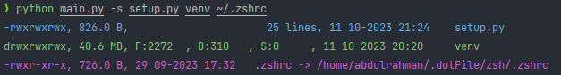
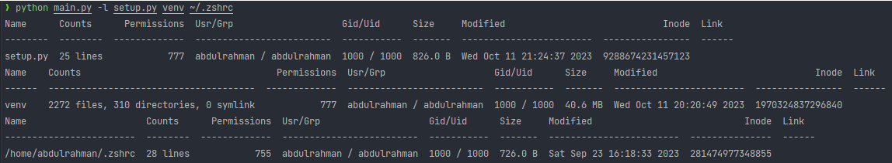

# File Info

File Info is a Python script that can display some information about files and directories, such as size, modification time, permissions, and number of lines. It also uses some color codes to print the output in different colors depending on the file type.

## Project Requirements

This project requires Python 3.x and the following packages:

- tabulate
- wmi (only for Windows)

You can install these packages using the `pip install -r requirements.txt` command.

## Installation

To install this project, you can download it from GitHub.

### From GitHub

To install this project from GitHub, first clone or download this repository:

```bash
git clone https://github.com/abdalrohman/file_info_python.git
```

Then navigate to the directory where you cloned or downloaded it and run the following command:

```bash
python setup.py install
```

## Usage

To use this project, you can run it as a script with one or more paths as arguments:

```bash
python -m file_info [-s | -l] [paths ...]
```

The `-s` option enables the short mode, which displays some basic information about each path.

The `-l` option enables the long mode, which displays more detailed information about each path in a table format.

If no option is given, the short mode is used by default.

If no path is given, the current directory (.) is used by default.

For example, to display some information about the current directory in short mode, run the following command:

```bash
python -m file_info
```

The output will look something like this:



To display more information about the current directory and a file in long mode, run the following command:

```bash
python -m file_info -l . file_info.py
```

The output will look something like this:



## License

This project is licensed under the GNU V3.0 License. See the [LICENSE](LICENSE) file for more details.
